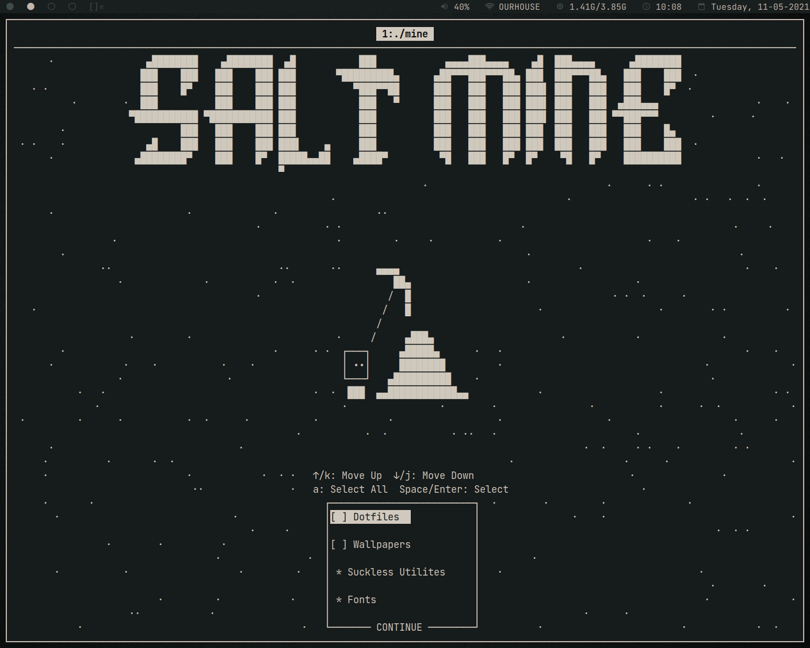

# Salt Mine

Automatically download my salty dotfiles

## Build Dependencies
* ncurses
* curl
* libgit2

## Runtime Dependencies
* tar (For extracting tar.gz files)
* patch (For patching suckless builds)

## TODO
- [X] Implement checkout function for cloning dotfiles (Kind of, found a workaround)
- [X] Implement cloning Suckless Utilites
- [ ] Implement building Suckless Utilites
- [X] Fix fonts
- [X] Fix herbe
- [X] Add submenus (Sukless utilites and fonts)
- [X] Rewrite draw functions (make windows/clear them/refresh them automatically) (wmove, wresize, wrefresh)
